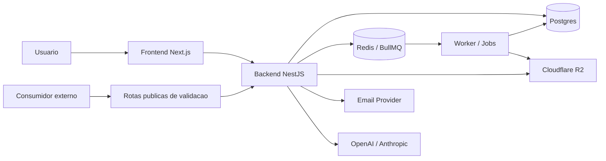

# Arquitetura e Rotas do Sistema

Este documento serve como mapa macro do sistema.

Objetivo:

- mostrar a arquitetura real do produto
- desenhar as integracoes principais
- listar as rotas do frontend
- listar as rotas do backend por controller

Use este arquivo quando a pergunta for:

- "como o sistema esta montado?"
- "qual e o caminho de uma tela ate a API?"
- "quais rotas existem hoje?"
- "onde entra frontend, backend, worker, storage e integracoes?"

## Visao arquitetural

O sistema hoje tem estes blocos principais:

- `frontend`
  - Next.js App Router
  - shell autenticado
  - modulos operacionais e documentais
- `backend`
  - NestJS
  - APIs de dominio, auth, dashboard, governanca documental e integracoes
- `worker`
  - processamento assincrono
  - importacao documental, bundles e rotinas de fila
- `postgres`
  - persistencia principal
- `redis`
  - fila, cache e coordenacao operacional
- `cloudflare r2`
  - storage governado de PDFs, videos e anexos oficiais
- `mail`
  - envio de notificacoes e artefatos documentais
- `ia`
  - fluxos do agente, classificacao e assistencia operacional

## Desenho macro da arquitetura



## Fluxos principais

### Fluxo autenticado normal

1. usuario entra no frontend
2. frontend chama o backend
3. backend valida auth, tenant e RBAC
4. backend acessa banco, fila, storage e servicos auxiliares
5. frontend renderiza lista, formulario, dashboard ou artefato

### Fluxo documental governado

1. modulo cria ou atualiza documento
2. backend controla lock, assinatura, governanca e storage
3. PDF final, video ou anexo oficial vai para storage governado
4. registry documental guarda referencia oficial
5. frontend consome contrato de disponibilidade e acesso

### Fluxo publico de validacao

1. usuario externo acessa codigo publico
2. frontend ou link direto chama rota publica do backend
3. backend consulta registry/assinatura/documento publico
4. retorno informa se o artefato e valido e qual prova existe

## Regras estruturais importantes

- backend e a autoridade final de tenant/company isolation
- backend e a autoridade final de lock/read-only
- storage governado e o caminho oficial para artefato final
- fallback degradado nao deve ser tratado como documento oficial saudavel
- frontend orienta a operacao, mas nao decide permissao real

## Mapa completo de rotas do frontend

Convencoes:

- `[id]` = parametro dinamico
- `[templateId]` = parametro dinamico
- `[code]` = codigo publico de validacao

```text
/
|-- /login
|-- /forgot-password
|-- /reset-password
|-- /verify
|-- /validar/[code]
`-- /dashboard
    |-- /
    |-- /activities
    |   |-- /new
    |   `-- /edit/[id]
    |-- /aprs
    |   |-- /new
    |   `-- /edit/[id]
    |-- /audits
    |   |-- /new
    |   `-- /edit/[id]
    |-- /calendar
    |-- /cats
    |-- /checklist-models
    |   |-- /new
    |   `-- /edit/[id]
    |-- /checklist-templates
    |   |-- /new
    |   `-- /edit/[id]
    |-- /checklists
    |   |-- /new
    |   |-- /edit/[id]
    |   `-- /fill/[templateId]
    |-- /companies
    |   |-- /new
    |   `-- /edit/[id]
    |-- /corrective-actions
    |-- /dds
    |   |-- /new
    |   `-- /edit/[id]
    |-- /document-pendencies
    |-- /document-registry
    |-- /documentos
    |   |-- /importar
    |   `-- /novo
    |-- /dossiers
    |-- /employees
    |   |-- /new
    |   `-- /[id]
    |-- /epi-fichas
    |-- /epis
    |   |-- /new
    |   `-- /edit/[id]
    |-- /executive
    |-- /import
    |-- /inspections
    |   |-- /new
    |   `-- /edit/[id]
    |-- /kpis
    |-- /machines
    |   |-- /new
    |   `-- /edit/[id]
    |-- /medical-exams
    |-- /nonconformities
    |   |-- /new
    |   `-- /edit/[id]
    |-- /pts
    |   |-- /new
    |   `-- /edit/[id]
    |-- /rdos
    |-- /reports
    |-- /risk-map
    |-- /risks
    |   |-- /new
    |   `-- /edit/[id]
    |-- /service-orders
    |-- /settings
    |-- /sites
    |   |-- /new
    |   `-- /edit/[id]
    |-- /sst-agent
    |-- /system
    |   `-- /settings
    |       `-- /theme
    |-- /tools
    |   |-- /new
    |   `-- /edit/[id]
    |-- /trainings
    |   |-- /new
    |   `-- /edit/[id]
    |-- /tst
    |-- /users
    |   |-- /new
    |   `-- /edit/[id]
    `-- /workers
        `-- /timeline
```

## Mapa completo de rotas do backend

Observacao:

- abaixo estao listadas as rotas mapeadas nos controllers do backend
- a listagem e por namespace/controller
- algumas rotas sao tecnicas, publicas ou de exemplo
- o backend possui mais de um controller na area de `health`, entao pode haver sobreposicao historica de endpoints

### Base e health

```text
/
|-- GET /
|-- GET /health/public
|-- GET /health
|-- GET /api
|-- GET /health
|-- GET /health/ready
|-- GET /health/live
|-- GET /health/puppeteer
|-- GET /health/detailed
|-- GET /health/ready
`-- GET /health/live
```

### Auth e sessoes

```text
/auth
|-- POST /auth/login
|-- POST /auth/refresh
|-- POST /auth/logout
|-- POST /auth/change-password
|-- POST /auth/forgot-password
|-- POST /auth/reset-password
|-- GET  /auth/me
|-- GET  /auth/signature-pin/status
`-- POST /auth/signature-pin

/sessions
|-- GET    /sessions
|-- DELETE /sessions/:id
`-- DELETE /sessions
```

### Dashboard

```text
/dashboard
|-- GET  /dashboard/summary
|-- GET  /dashboard/kpis
|-- GET  /dashboard/heatmap
|-- GET  /dashboard/tst-day
|-- GET  /dashboard/pending-queue
|-- GET  /dashboard/document-pendencies
|-- POST /dashboard/document-pendencies/actions/resolve
`-- POST /dashboard/document-pendencies/imports/:id/retry
```

### Rotas publicas de validacao

```text
/public
|-- GET /public/documents/validate
|-- GET /public/signature/verify
|-- GET /public/checklists/validate
|-- GET /public/inspections/validate
|-- GET /public/cats/validate
|-- GET /public/dossiers/validate
`-- GET /public/evidence/verify
```

### Registry e seguranca de PDF

```text
/document-registry
|-- GET /document-registry
`-- GET /document-registry/weekly-bundle

/pdf-security
|-- POST /pdf-security/sign
`-- GET  /pdf-security/verify/:hash
```

### Importacao documental

```text
/documents/import
|-- POST /documents/import
`-- GET  /documents/import/:id/status
```

### Assinaturas

```text
/signatures
|-- POST   /signatures
|-- GET    /signatures
|-- GET    /signatures/verify/:id
|-- DELETE /signatures/:id
`-- DELETE /signatures/document/:document_id
```

### APR

```text
/aprs
|-- POST   /aprs
|-- GET    /aprs
|-- GET    /aprs/files/list
|-- GET    /aprs/files/weekly-bundle
|-- GET    /aprs/export/excel
|-- GET    /aprs/export/excel/template
|-- POST   /aprs/import/excel/preview
|-- GET    /aprs/risks/matrix
|-- POST   /aprs/risk-controls/suggestions
|-- GET    /aprs/analytics/overview
|-- GET    /aprs/:id/export/excel
|-- GET    /aprs/:id
|-- GET    /aprs/:id/pdf
|-- GET    /aprs/:id/logs
|-- GET    /aprs/:id/versions
|-- GET    /aprs/:id/evidence
|-- POST   /aprs/:id/risk-items/:riskItemId/evidence
|-- POST   /aprs/:id/file
|-- POST   /aprs/:id/approve
|-- POST   /aprs/:id/reject
|-- POST   /aprs/:id/finalize
|-- POST   /aprs/:id/new-version
|-- PATCH  /aprs/:id
`-- DELETE /aprs/:id
```

### PT

```text
/pts
|-- POST   /pts
|-- POST   /pts/:id/approve
|-- POST   /pts/:id/pre-approval-review
|-- GET    /pts/:id/pre-approval-history
|-- POST   /pts/:id/reject
|-- GET    /pts
|-- GET    /pts/files/list
|-- GET    /pts/files/weekly-bundle
|-- GET    /pts/export/excel
|-- GET    /pts/approval-rules
|-- GET    /pts/analytics/overview
|-- PATCH  /pts/approval-rules
|-- GET    /pts/:id/pdf
|-- POST   /pts/:id/finalize
|-- POST   /pts/:id/file
|-- GET    /pts/:id
|-- PATCH  /pts/:id
`-- DELETE /pts/:id
```

### DDS

```text
/dds
|-- POST   /dds
|-- POST   /dds/with-file
|-- GET    /dds
|-- GET    /dds/historical-photo-hashes
|-- GET    /dds/files/list
|-- GET    /dds/files/weekly-bundle
|-- GET    /dds/:id
|-- GET    /dds/:id/pdf
|-- GET    /dds/:id/videos
|-- GET    /dds/:id/videos/:attachmentId/access
|-- PUT    /dds/:id/signatures
|-- POST   /dds/:id/file
|-- POST   /dds/:id/videos
|-- DELETE /dds/:id/videos/:attachmentId
|-- PATCH  /dds/:id/status
|-- PATCH  /dds/:id
`-- DELETE /dds/:id
```

### RDO

```text
/rdos
|-- POST   /rdos
|-- GET    /rdos
|-- GET    /rdos/files/list
|-- GET    /rdos/files/weekly-bundle
|-- GET    /rdos/export/excel
|-- GET    /rdos/analytics/overview
|-- GET    /rdos/:id
|-- GET    /rdos/:id/pdf
|-- GET    /rdos/:id/videos
|-- GET    /rdos/:id/videos/:attachmentId/access
|-- PATCH  /rdos/:id
|-- PATCH  /rdos/:id/status
|-- PATCH  /rdos/:id/sign
|-- POST   /rdos/:id/cancel
|-- POST   /rdos/:id/save-pdf
|-- POST   /rdos/:id/file
|-- POST   /rdos/:id/videos
|-- DELETE /rdos/:id/videos/:attachmentId
|-- POST   /rdos/:id/send-email
|-- GET    /rdos/:id/audit
`-- DELETE /rdos/:id
```

### Inspecoes

```text
/inspections
|-- POST   /inspections
|-- GET    /inspections
|-- GET    /inspections/files/list
|-- GET    /inspections/files/weekly-bundle
|-- GET    /inspections/:id
|-- GET    /inspections/:id/pdf
|-- GET    /inspections/:id/evidences/:index/file
|-- GET    /inspections/:id/videos
|-- GET    /inspections/:id/videos/:attachmentId/access
|-- PATCH  /inspections/:id
|-- DELETE /inspections/:id
|-- POST   /inspections/:id/evidences
|-- POST   /inspections/:id/videos
|-- DELETE /inspections/:id/videos/:attachmentId
`-- POST   /inspections/:id/file
```

### Checklists

```text
/checklists
|-- POST   /checklists/seed/welding-machine
|-- POST   /checklists/templates/bootstrap
|-- POST   /checklists/import-word
|-- POST   /checklists
|-- GET    /checklists
|-- GET    /checklists/files/list
|-- GET    /checklists/files/weekly-bundle
|-- GET    /checklists/:id
|-- GET    /checklists/:id/pdf
|-- GET    /checklists/:id/equipment-photo/access
|-- GET    /checklists/:id/items/:itemIndex/photos/:photoIndex/access
|-- PATCH  /checklists/:id
|-- POST   /checklists/:id/send-email
|-- POST   /checklists/fill-from-template/:templateId
|-- POST   /checklists/:id/save-pdf
|-- POST   /checklists/:id/equipment-photo
|-- POST   /checklists/:id/items/:itemIndex/photos
`-- DELETE /checklists/:id
```

### Nao conformidades

```text
/nonconformities
|-- POST   /nonconformities
|-- GET    /nonconformities
|-- GET    /nonconformities/files/list
|-- GET    /nonconformities/files/weekly-bundle
|-- GET    /nonconformities/analytics/monthly
|-- GET    /nonconformities/analytics/overview
|-- GET    /nonconformities/export/excel
|-- GET    /nonconformities/:id
|-- GET    /nonconformities/:id/pdf
|-- GET    /nonconformities/:id/attachments/:index/access
|-- POST   /nonconformities/:id/file
|-- POST   /nonconformities/:id/attachments
|-- PATCH  /nonconformities/:id/status
|-- PATCH  /nonconformities/:id
`-- DELETE /nonconformities/:id
```

### CAT

```text
/cats
|-- POST   /cats
|-- GET    /cats
|-- GET    /cats/summary
|-- GET    /cats/statistics
|-- GET    /cats/:id
|-- GET    /cats/:id/pdf
|-- PATCH  /cats/:id
|-- POST   /cats/:id/investigation
|-- POST   /cats/:id/close
|-- POST   /cats/:id/file
|-- POST   /cats/:id/pdf/file
|-- DELETE /cats/:id/attachments/:attachmentId
`-- GET    /cats/:id/attachments/:attachmentId/access
```

### Auditorias e dossies

```text
/audits
|-- POST   /audits
|-- GET    /audits
|-- GET    /audits/files/list
|-- GET    /audits/files/weekly-bundle
|-- GET    /audits/:id
|-- GET    /audits/:id/pdf
|-- POST   /audits/:id/file
|-- PATCH  /audits/:id
`-- DELETE /audits/:id

/dossiers
|-- GET  /dossiers/employee/:userId/pdf
|-- GET  /dossiers/employee/:userId/context
|-- GET  /dossiers/site/:siteId/context
|-- GET  /dossiers/employee/:userId/pdf/access
|-- POST /dossiers/employee/:userId/pdf/file
|-- GET  /dossiers/site/:siteId/pdf/access
|-- POST /dossiers/site/:siteId/pdf/file
`-- GET  /dossiers/contract/:contractId/pdf
```

### Empresas, sites, usuarios e perfis

```text
/companies
|-- POST   /companies
|-- GET    /companies
|-- GET    /companies/:id
|-- PATCH  /companies/:id
`-- DELETE /companies/:id

/sites
|-- POST   /sites
|-- GET    /sites
|-- GET    /sites/:id
|-- PATCH  /sites/:id
`-- DELETE /sites/:id

/users
|-- POST   /users
|-- GET    /users
|-- GET    /users/worker-status/cpf/:cpf
|-- GET    /users/worker-status/cpf/:cpf/timeline
|-- GET    /users/:id
|-- GET    /users/:id/timeline
|-- PATCH  /users/:id
|-- PATCH  /users/:id/gdpr-erasure
`-- DELETE /users/:id

/profiles
|-- POST   /profiles
|-- GET    /profiles
|-- GET    /profiles/:id
|-- PATCH  /profiles/:id
`-- DELETE /profiles/:id
```

### Riscos, atividades, service orders, corretivas

```text
/risks
|-- POST   /risks
|-- GET    /risks
|-- GET    /risks/:id
|-- PATCH  /risks/:id
`-- DELETE /risks/:id

/activities
|-- POST   /activities
|-- GET    /activities
|-- GET    /activities/:id
|-- PATCH  /activities/:id
`-- DELETE /activities/:id

/service-orders
|-- POST   /service-orders
|-- GET    /service-orders
|-- GET    /service-orders/export/excel
|-- GET    /service-orders/:id
|-- PATCH  /service-orders/:id
|-- PATCH  /service-orders/:id/status
`-- DELETE /service-orders/:id

/corrective-actions
|-- POST   /corrective-actions
|-- POST   /corrective-actions/from/nonconformity/:id
|-- POST   /corrective-actions/from/audit/:id
|-- GET    /corrective-actions
|-- GET    /corrective-actions/summary
|-- GET    /corrective-actions/sla/overview
|-- GET    /corrective-actions/sla/by-site
|-- POST   /corrective-actions/sla/escalate
|-- GET    /corrective-actions/:id
|-- PATCH  /corrective-actions/:id
|-- PATCH  /corrective-actions/:id/status
`-- DELETE /corrective-actions/:id
```

### EPI, maquinas, ferramentas, treinamentos, exames

```text
/epis
`-- GET /epis

/epi-assignments
|-- POST   /epi-assignments
|-- GET    /epi-assignments
|-- GET    /epi-assignments/summary
|-- GET    /epi-assignments/:id
|-- PATCH  /epi-assignments/:id
|-- POST   /epi-assignments/:id/return
`-- POST   /epi-assignments/:id/replace

/machines
`-- GET /machines

/tools
`-- GET /tools

/trainings
|-- POST   /trainings
|-- GET    /trainings
|-- GET    /trainings/user/:userId
|-- GET    /trainings/expiry/summary
|-- GET    /trainings/expiry/expiring
|-- POST   /trainings/expiry/notify
|-- GET    /trainings/compliance/blocking-users
|-- GET    /trainings/compliance/user/:userId
|-- GET    /trainings/export/excel
|-- GET    /trainings/:id
|-- PATCH  /trainings/:id
`-- DELETE /trainings/:id

/medical-exams
|-- POST   /medical-exams
|-- GET    /medical-exams
|-- GET    /medical-exams/expiry/summary
|-- GET    /medical-exams/export/excel
|-- GET    /medical-exams/:id
|-- PATCH  /medical-exams/:id
`-- DELETE /medical-exams/:id
```

### IA, agente e suporte tecnico

```text
/ai
|-- GET  /ai/status
|-- POST /ai/insights
|-- POST /ai/analyze-apr
|-- POST /ai/analyze-pt
|-- GET  /ai/analyze-checklist/:id
|-- POST /ai/generate-dds
|-- POST /ai/generate-checklist
|-- POST /ai/generate-apr-draft
|-- POST /ai/generate-pt-draft
|-- POST /ai/create-checklist
|-- POST /ai/create-dds
|-- POST /ai/create-nonconformity
`-- POST /ai/generate-monthly-report

/ai/sst
|-- POST /ai/sst/chat
|-- POST /ai/sst/analyze-image-risk
|-- GET  /ai/sst/history
`-- GET  /ai/sst/history/:id

/sophie
|-- GET  /sophie/version
`-- POST /sophie/analyze
```

### Mail, notificacoes, push, storage e tema

```text
/mail
|-- GET  /mail/logs/export
|-- GET  /mail/logs
|-- POST /mail/send-stored-document
|-- POST /mail/send-uploaded-document
`-- POST /mail/alerts/dispatch

/notifications
|-- GET   /notifications
|-- GET   /notifications/unread-count
|-- PATCH /notifications/:id/read
`-- POST  /notifications/read-all

/push
|-- GET    /push/public-key
|-- POST   /push/subscribe
`-- DELETE /push/unsubscribe

/storage
`-- POST /storage/presigned-url

/system-theme
|-- GET   /system-theme/presets
|-- GET   /system-theme
|-- PATCH /system-theme
|-- POST  /system-theme/presets/:presetId/apply
`-- POST  /system-theme/reset
```

### Calendar, reports, math e exemplos

```text
/calendar
`-- GET /calendar/events

/reports
|-- GET    /reports
|-- POST   /reports/generate
|-- GET    /reports/monthly
|-- DELETE /reports/:id
|-- GET    /reports/status/:jobId
|-- GET    /reports/queue/stats
|-- GET    /reports/jobs
`-- GET    /reports/:id

/math
|-- GET /math/sum
|-- GET /math/subtract
|-- GET /math/multiply
`-- GET /math/divide

/examples/rate-limit
|-- POST /examples/rate-limit/reports
|-- POST /examples/rate-limit/pdf/generate
|-- GET  /examples/rate-limit/public/data
|-- GET  /examples/rate-limit/stats
`-- POST /examples/rate-limit/reset
```

## Onde cada camada conversa com a outra

### Frontend para backend

Padrao principal:

- pagina em `frontend/app/dashboard/<modulo>`
- service em `frontend/services/<modulo>Service.ts`
- controller em `backend/src/<modulo>/<modulo>.controller.ts`
- service de dominio em `backend/src/<modulo>/<modulo>.service.ts`

### Backend para storage

Padrao principal:

- `DocumentStorageService`
- `DocumentGovernanceService`
- `DocumentRegistryService`
- `S3Service` configurado para Cloudflare R2 no ambiente atual

### Backend para fila

Padrao principal:

- `document-import`
- `reports`
- worker e servicos com Redis/BullMQ

## Consultas complementares

- modulos e regras: [`mapa-de-modulos.md`](./mapa-de-modulos.md)
- o que foi implementado recentemente: [`implementacoes-recentes.md`](./implementacoes-recentes.md)
- PDFs finais e storage: [`pdfs-finais-e-storage.md`](./pdfs-finais-e-storage.md)
- seguranca e governanca: [`seguranca-e-governanca.md`](./seguranca-e-governanca.md)
