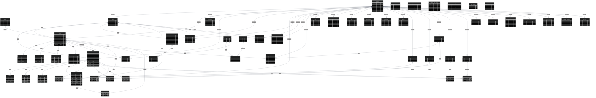

# Diagrama do Banco (Mermaid)

```mermaid
%%{init: {
  "theme": "dark",
  "er": { "layoutDirection": "LR" },
  "themeVariables": {
    "background": "#0b0f14",
    "primaryColor": "#0f172a",
    "primaryTextColor": "#d1d5db",
    "primaryBorderColor": "#374151",
    "lineColor": "#4b5563",
    "fontFamily": "ui-sans-serif",
    "fontSize": "11px"
  }
}}%%
erDiagram
    %% Núcleo multi-tenant
    COMPANIES {
        uuid id PK
        string cnpj UK
        string status
        timestamptz created_at
        timestamptz deleted_at
    }
    PROFILES {
        uuid id PK
        string nome
        jsonb permissoes
    }
    USERS {
        uuid id PK
        uuid company_id FK
        uuid profile_id FK
        uuid site_id FK
        timestamptz created_at
        timestamptz deleted_at
    }
    SITES {
        uuid id PK
        uuid company_id FK
        string nome
    }
    CONTRACTS {
        uuid id PK
        uuid company_id FK
        string status
    }
    USER_SESSIONS {
        uuid id PK
        uuid user_id FK
        boolean is_active
    }
    NOTIFICATIONS {
        uuid id PK
        uuid user_id FK
        boolean read
    }
    PUSH_SUBSCRIPTIONS {
        uuid id PK
        uuid user_id FK
        string endpoint
    }

    %% Operacional SST
    APRS {
        uuid id PK
        uuid company_id FK
        uuid site_id FK
        uuid elaborador_id FK
        string status
        timestamptz created_at
        timestamptz deleted_at
    }
    APR_LOGS {
        uuid id PK
        uuid apr_id FK
        string action
    }
    APR_RISK_ITEMS {
        uuid id PK
        uuid apr_id FK
        string hazard
    }
    APR_RISK_EVIDENCES {
        uuid id PK
        uuid apr_id FK
        string file_path
    }
    DDS {
        uuid id PK
        uuid company_id FK
        uuid site_id FK
        string status
        timestamptz deleted_at
    }
    PTS {
        uuid id PK
        uuid company_id FK
        uuid site_id FK
        uuid apr_id FK
        string status
        timestamptz deleted_at
    }
    INSPECTIONS {
        uuid id PK
        uuid company_id FK
        uuid site_id FK
    }
    CHECKLISTS {
        uuid id PK
        uuid company_id FK
        uuid site_id FK
    }
    AUDITS {
        uuid id PK
        uuid company_id FK
        uuid site_id FK
        timestamptz deleted_at
    }
    EPI_ASSIGNMENTS {
        uuid id PK
        uuid company_id FK
        uuid epi_id FK
        uuid user_id FK
    }
    CATS {
        uuid id PK
        uuid company_id FK
        string numero
    }
    NONCONFORMITIES {
        uuid id PK
        uuid company_id FK
        string codigo_nc
        timestamptz deleted_at
    }
    RDOS {
        uuid id PK
        uuid company_id FK
        string numero
    }
    MEDICAL_EXAMS {
        uuid id PK
        uuid company_id FK
        string tipo
    }
    SERVICE_ORDERS {
        uuid id PK
        uuid company_id FK
        string numero
    }
    REPORTS {
        uuid id PK
        uuid company_id FK
        string report_type
    }
    ACTIVITIES {
        uuid id PK
        uuid company_id FK
    }
    RISKS {
        uuid id PK
        uuid company_id FK
    }
    EPIS {
        uuid id PK
        uuid company_id FK
    }
    TOOLS {
        uuid id PK
        uuid company_id FK
    }
    MACHINES {
        uuid id PK
        uuid company_id FK
    }
    TRAININGS {
        uuid id PK
        uuid company_id FK
    }
    SIGNATURES {
        uuid id PK
        uuid company_id FK
    }

    %% Junções
    APR_ACTIVITIES {
        uuid apr_id PK
        uuid activity_id PK
    }
    APR_RISKS {
        uuid apr_id PK
        uuid risk_id PK
    }
    APR_EPIS {
        uuid apr_id PK
        uuid epi_id PK
    }
    APR_TOOLS {
        uuid apr_id PK
        uuid tool_id PK
    }
    APR_MACHINES {
        uuid apr_id PK
        uuid machine_id PK
    }
    APR_PARTICIPANTS {
        uuid apr_id PK
        uuid user_id PK
    }
    DDS_PARTICIPANTS {
        uuid dds_id PK
        uuid user_id PK
    }
    PT_EXECUTANTES {
        uuid pt_id PK
        uuid user_id PK
    }

    %% Documental e governança
    DOCUMENT_REGISTRY {
        uuid id PK
        uuid company_id FK
        string module
        string document_type
    }
    DOCUMENT_IMPORTS {
        uuid id PK
        string empresa_id
        string status
    }
    DOCUMENT_VIDEO_ATTACHMENTS {
        uuid id PK
        string company_id
        string module
    }
    PDF_INTEGRITY_RECORDS {
        uuid id PK
        uuid company_id FK
        string hash UK
    }
    TENANT_DOCUMENT_POLICIES {
        uuid id PK
        uuid company_id FK
    }

    %% Segurança / RBAC
    ROLES {
        uuid id PK
        string name UK
    }
    PERMISSIONS {
        uuid id PK
        string name UK
    }
    ROLE_PERMISSIONS {
        uuid role_id PK
        uuid permission_id PK
    }
    USER_ROLES {
        uuid user_id PK
        uuid role_id PK
    }
    AUDIT_LOGS {
        uuid id PK
        uuid user_id FK
        string action
        timestamptz created_at
    }

    %% Observabilidade / DR / IA
    FORENSIC_TRAIL_EVENTS {
        uuid id PK
        string company_id
        string event_hash UK
        timestamptz created_at
    }
    DISASTER_RECOVERY_EXECUTIONS {
        uuid id PK
        string operation_type
        string status
    }
    MONTHLY_SNAPSHOTS {
        uuid id PK
        uuid company_id FK
        date reference_month
    }
    RISK_HISTORY {
        uuid id PK
        jsonb payload
    }
    AI_INTERACTIONS {
        uuid id PK
        string tenant_id
        string model
    }
    MAIL_LOGS {
        uuid id PK
        uuid company_id FK
        string status
    }

    %% Relações principais
    COMPANIES ||--o{ SITES : company_id
    COMPANIES ||--o{ USERS : company_id
    COMPANIES ||--o{ CONTRACTS : company_id
    COMPANIES ||--o{ APRS : company_id
    COMPANIES ||--o{ DDS : company_id
    COMPANIES ||--o{ PTS : company_id
    COMPANIES ||--o{ INSPECTIONS : company_id
    COMPANIES ||--o{ CHECKLISTS : company_id
    COMPANIES ||--o{ AUDITS : company_id
    COMPANIES ||--o{ EPI_ASSIGNMENTS : company_id
    COMPANIES ||--o{ CATS : company_id
    COMPANIES ||--o{ NONCONFORMITIES : company_id
    COMPANIES ||--o{ RDOS : company_id
    COMPANIES ||--o{ MEDICAL_EXAMS : company_id
    COMPANIES ||--o{ SERVICE_ORDERS : company_id
    COMPANIES ||--o{ REPORTS : company_id
    COMPANIES ||--o{ ACTIVITIES : company_id
    COMPANIES ||--o{ RISKS : company_id
    COMPANIES ||--o{ EPIS : company_id
    COMPANIES ||--o{ TOOLS : company_id
    COMPANIES ||--o{ MACHINES : company_id
    COMPANIES ||--o{ TRAININGS : company_id
    COMPANIES ||--o{ SIGNATURES : company_id
    COMPANIES ||--o{ DOCUMENT_REGISTRY : company_id
    COMPANIES ||--o| TENANT_DOCUMENT_POLICIES : company_id
    COMPANIES ||--o{ PDF_INTEGRITY_RECORDS : company_id
    COMPANIES ||--o{ MONTHLY_SNAPSHOTS : company_id
    COMPANIES ||--o{ MAIL_LOGS : company_id

    PROFILES ||--o{ USERS : profile_id
    SITES ||--o{ USERS : site_id
    USERS ||--o{ USER_SESSIONS : user_id
    USERS ||--o{ NOTIFICATIONS : user_id
    USERS ||--o{ PUSH_SUBSCRIPTIONS : user_id
    USERS ||--o{ AUDIT_LOGS : user_id
    USERS ||--o{ USER_ROLES : user_id

    SITES ||--o{ APRS : site_id
    SITES ||--o{ DDS : site_id
    SITES ||--o{ PTS : site_id
    SITES ||--o{ INSPECTIONS : site_id
    SITES ||--o{ CHECKLISTS : site_id
    SITES ||--o{ AUDITS : site_id
    USERS ||--o{ APRS : elaborador_id

    APRS ||--o{ APR_LOGS : apr_id
    APRS ||--o{ APR_RISK_ITEMS : apr_id
    APRS ||--o{ APR_RISK_EVIDENCES : apr_id
    APRS ||--o{ PTS : apr_id
    EPIS ||--o{ EPI_ASSIGNMENTS : epi_id
    USERS ||--o{ EPI_ASSIGNMENTS : user_id

    APRS ||--o{ APR_ACTIVITIES : apr_id
    ACTIVITIES ||--o{ APR_ACTIVITIES : activity_id
    APRS ||--o{ APR_RISKS : apr_id
    RISKS ||--o{ APR_RISKS : risk_id
    APRS ||--o{ APR_EPIS : apr_id
    EPIS ||--o{ APR_EPIS : epi_id
    APRS ||--o{ APR_TOOLS : apr_id
    TOOLS ||--o{ APR_TOOLS : tool_id
    APRS ||--o{ APR_MACHINES : apr_id
    MACHINES ||--o{ APR_MACHINES : machine_id
    APRS ||--o{ APR_PARTICIPANTS : apr_id
    USERS ||--o{ APR_PARTICIPANTS : user_id
    DDS ||--o{ DDS_PARTICIPANTS : dds_id
    USERS ||--o{ DDS_PARTICIPANTS : user_id
    PTS ||--o{ PT_EXECUTANTES : pt_id
    USERS ||--o{ PT_EXECUTANTES : user_id

    ROLES ||--o{ ROLE_PERMISSIONS : role_id
    PERMISSIONS ||--o{ ROLE_PERMISSIONS : permission_id
    ROLES ||--o{ USER_ROLES : role_id
```

Diagrama derivado das migrations versionadas do repositório; não representa snapshot live do banco.
